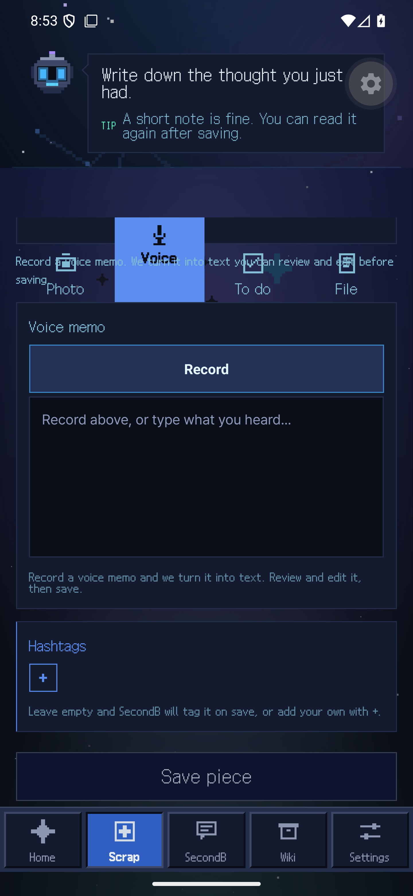
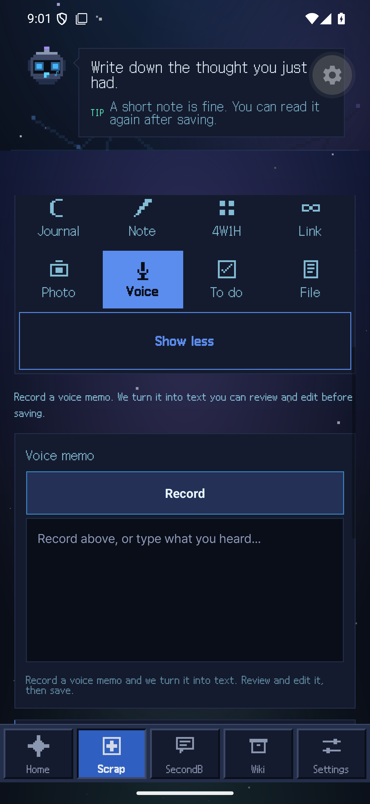

# Android 사진·음성 모드 탭 겹침 — 2026-09-26

## 결과

같은 1440×3120 / 560dpi Android API 36 AVD에서 `/capture-full?mode=ocr`와
`/capture-full?mode=voice`를 비교했다. 수정 전에는 선택 탭이 다음 안내 문구를
덮었고, 수정 후에는 탭·`Show less`·안내가 각각의 공간에 그려졌다.

| 모드 | 수정 전 | 수정 후 |
|---|---|---|
| 사진 | [겹친 화면](android-capture-layout-260926/photo-before.png) | [분리된 화면](android-capture-layout-260926/photo-after.png) |
| 음성 | [겹친 화면](android-capture-layout-260926/voice-before.png) | [분리된 화면](android-capture-layout-260926/voice-after.png) |

## 원인과 변경

`src/app/capture.tsx`의 여러 줄 모드 행에서 각 탭이 `flex: 1`만 사용했고,
다음 안내 문구는 음수 상단 여백을 사용했다. Native 화면에서 선택 탭이 설명을
덮는 현상을 재현했다. 탭에 `flexBasis`, `flexGrow`, `flexShrink`, 최소 높이를
명시하고 안내 문구에 양수 여백을 주었다. 72dp 최소 너비를 유지하면서 좁은
화면에서 탭을 다음 행으로 감기도록 설계했다. 320dp 실기동은 별도로 확인해야 한다.

수정 후 파일 ESLint와 TypeScript 검사는 PASS였다. AVD는 기존 x86_64 debug APK에
통합 트리의 수정된 JS를 전용 IPv4 Metro 8084로 로드했다. UIAutomator XML이
제한된 시도 안에 생성되지 않아 탭/설명의 수치 bounds는 측정하지 못했다.
판정은 위 동일 기기 전후 스크린샷의 시각 비교다.

## 검증 범위

- 기존 QA 세션으로 Home, Photo, Voice 화면을 실제 렌더했다.
- Android 카메라·마이크 권한 프롬프트를 확인했다. 카메라는 일회 허용 후 시스템
  프리뷰까지만 열었고 촬영하지 않았다. 마이크는 거부했다.
- 실제 촬영·OCR·업로드·녹음·전사·저장·효과음의 가청 출력은 검증하지 않았다.
- 전용 AVD·Metro 종료와 5580/5581/8084 포트 닫힘을 확인했다. 공용 8081은 유지했다.
- 로컬 원본 기록은 `E:/2ndB/.worktrees/native-260926/Output/runtime-validation-260926/gui-runtime-result.json`
  및 `layout-fix-runtime-result.json`에 있다. 운영 DB·Edge 쓰기와 유료 호출은 없다.
