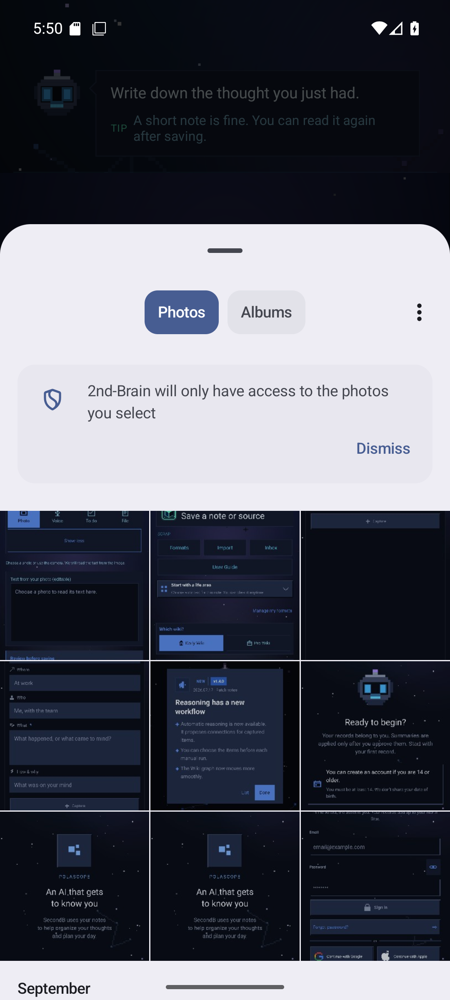
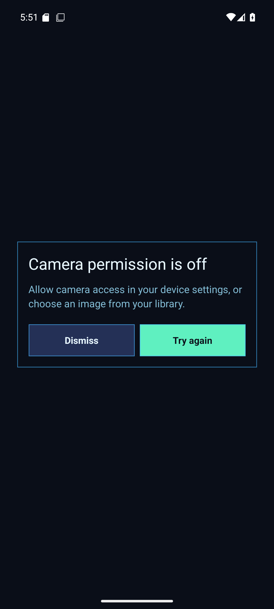
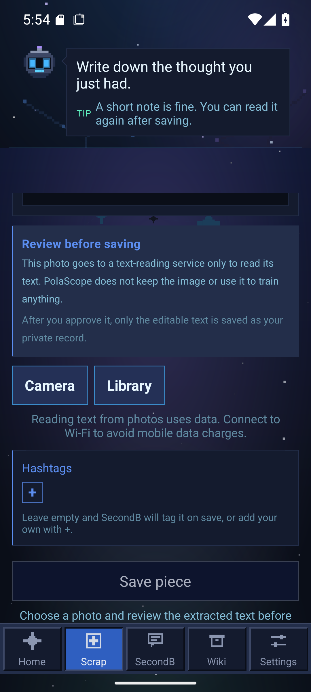

# Android 사진 입력 네이티브 QA — 2026-10-01

## 범위와 빌드

- 기기: 새 Pixel 7 Android 16/API 36 x86_64 에뮬레이터 `2ndB_Codex_NativeQA_261001`.
- 앱: [수동 진단 빌드 36687352385](https://github.com/Simon-YHKim/2nd-B/actions/runs/36687352385)의 커밋 `4ee03669444842b03ee729d233f52b7c395318c2` APK. APK에 `lib/x86_64/libreactnative.so`가 있다.
- 최신 [진단 빌드 36745473207](https://github.com/Simon-YHKim/2nd-B/actions/runs/36745473207)의 `0e2bb32e` APK는 `lib/arm64-v8a/libreactnative.so`만 있어 이 x86_64 에뮬레이터에서 `SoLoader: couldn't find DSO to load: libreactnative.so`로 시작하지 못했다. ABI가 맞지 않는 테스트 환경의 결과이며 앱 코드 결함으로 분류하지 않는다.
- 공용 `.env.test` QA 계정으로 로그인했다. 사진 선택·메모 저장·운영 설정 변경은 하지 않았다. 화면 제어와 권한 거부만 실행했다.
- 문서 브랜치에 main `36623cc1`을 통합한 뒤 `npm run verify`가 870개 묶음, 11,279개 테스트를 통과했다. 이 자동 검증은 아래 네이티브 관찰의 대체가 아니다.

## 확인 결과

| 동작 | 관찰 | 판정 |
|---|---|---|
| Scrap → Photo → Library | Android 시스템 Photo Picker가 열렸다. 앱에는 선택한 사진만 제공된다는 시스템 안내가 보였다. 취소 뒤 앱으로 돌아왔다. | 통과 |
| Scrap → Photo → Camera | Android 카메라 권한 창이 열렸다. 거부하자 앱의 권한 안내, `Dismiss`, `Try again`이 표시됐다. 뒤로가기로 닫은 뒤 사진 입력 화면으로 복귀했다. | 통과 |
| 시스템 글꼴 130% | 사진 입력 화면 아래쪽까지 스크롤할 수 있었고 `Camera`, `Library`, `Save piece`, 하단 탐색을 화면에서 확인했다. 보이는 범위에서 잘림은 없었다. 검사 뒤 글꼴 배율을 1.0으로 복원했다. | 관찰 범위 통과 |

## 해석과 남은 확인

- 이 APK는 최신 main 이전 코드이므로 **네이티브 선택기·권한·뒤로가기 경로의 작동 증거**다. 최신 GUI와 10월 5일 이름 전환의 회귀 검증으로 쓰지 않는다. 시스템 사진 선택기의 앱 이름은 이 빌드에서 `2nd-Brain`이었다. PolaScope 네이티브 이름은 예정된 [PR #1902](https://github.com/Simon-YHKim/2nd-B/pull/1902) 적용 뒤 다시 확인한다.
- 글꼴 200% 확인을 시도했지만, 다시 켠 QA 앱이 기존 계정의 `First Record` 되돌아보기 화면을 표시했다. 뒤로가기와 읽기 전용 딥링크로는 사진 화면에 도달하지 못했다. 화면의 선택지는 기록 상태를 바꿀 수 있어 누르지 않았으며 글꼴을 100%로 복원하고 에뮬레이터를 종료했다. 200%는 통과로 판정하지 않는다.
- 사진을 실제 선택해 OCR에 넣는 경로, ARM 실기기, 최대 글꼴 크기, TalkBack의 읽기·초점 순서, 최신 main APK는 확인하지 않았다. 이 에뮬레이터 검사만으로 Play 출시를 승인하지 않는다.
- 로그와 추가 화면 원본은 로컬 Git 공통 디렉터리 `E:\2ndB\.git\app-parity\native-qa-261001`에 있다. 이 문서의 세 화면은 검증에 필요한 부분만 저장소에 복사했다.
