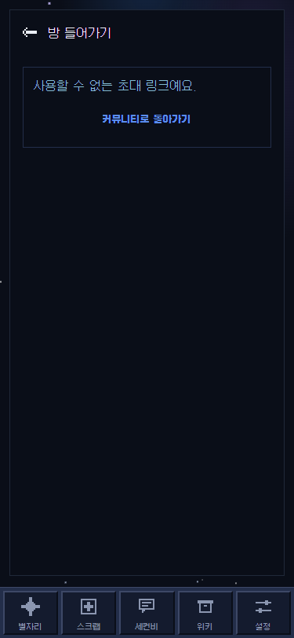

# 커뮤니티 초대 화면 QA — 2026-09-30

대상: `fix/community-join-lifecycle-260930`의 로컬 웹 미리보기, Chrome 375×812. QA 계정 로그인 후 `community_ensure_profile`과 `community_join` 응답만 브라우저에서 모의했고, 그 밖의 쓰기 요청은 차단했다. 운영 커뮤니티 쓰기 0건.

| 경로 | 확인 결과 | 페이지 오류 | 가로 넘침 |
|---|---|---:|---:|
| `/community/join/invalid-test-token` | “사용할 수 없는 초대 링크예요.”와 목록 복귀 표시 | 0 | 없음 |
| `/community/join/fake-valid-token` | 모의 입장 응답의 방 ID로 이동. 실제로 없는 방이어서 접근 불가 안내 표시 | 0 | 없음 |

비동기 회귀 테스트는 프로필 준비 전 초대 변경 시 입장 RPC를 부르지 않는지, 입장 응답·오류가 도착하기 전 화면이 바뀌면 이전 결과로 이동하거나 오류를 표시하지 않는지 확인한다. 화면 이탈과 재시도는 같은 요청 번호를 무효화한다.

모의 응답은 실제 초대 링크의 서버 권한·소진·만료 규칙을 검증하지 않는다. ARM Android 실기기의 뒤로가기·TalkBack도 별도로 확인해야 한다.
