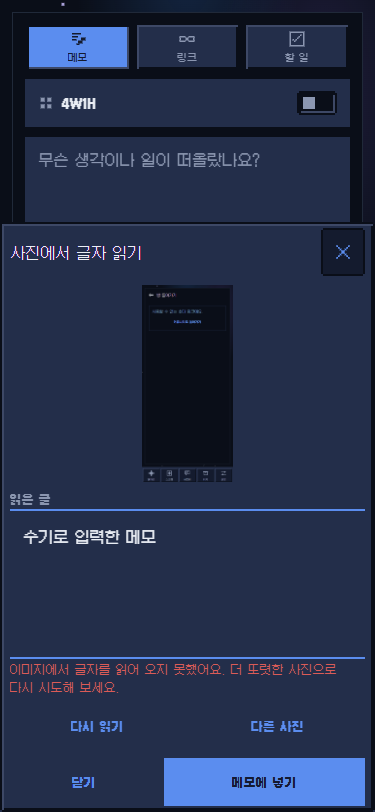

# 메모 OCR·저장 안내 GUI QA — 2026-10-01

대상: `fix/memo-gui-fixes-261001`의 격리된 8084 릴리스 모드 웹 미리보기, 375×812 Chrome. 공용 QA 계정으로 로그인한 뒤 OCR 요청의 POST 한 건을 브라우저에서 차단해 실패를 재현했다. 저장 버튼은 누르지 않았고 운영 기록 쓰기는 없었다.

| 확인 | 결과 |
|---|---|
| OCR 오류 직후 ‘메모에 넣기’ | 비활성 |
| 결과 상자에 `수기로 입력한 메모` 입력 뒤 | 활성 |
| ‘메모에 넣기’ 뒤 메모 본문 | 입력한 글이 그대로 들어감 |
| 페이지 오류 · 가로 넘침 | 0건 · 없음 |

비활성 저장 버튼의 안내는 기본 메모·링크·할 일에 공통 입력 문구를 쓰고, 4W1H가 켜진 메모에만 필수 ‘무엇을’ 칸 안내를 쓰도록 바꿨다. 영어·한국어·스페인어·포르투갈어·인도네시아어 키 패리티는 `npm run check:i18n`으로 확인했다. 웹 DOM은 React Native의 `accessibilityHint`를 노출하지 않아 실제 힌트 음성 출력은 여기서 확인하지 못했다.

OCR 성공 유료 경로, Android 사진 선택기, TalkBack은 이 모의 웹 QA의 범위 밖이다. 이 PC의 `adb devices -l`에는 연결 기기가 없었다.
